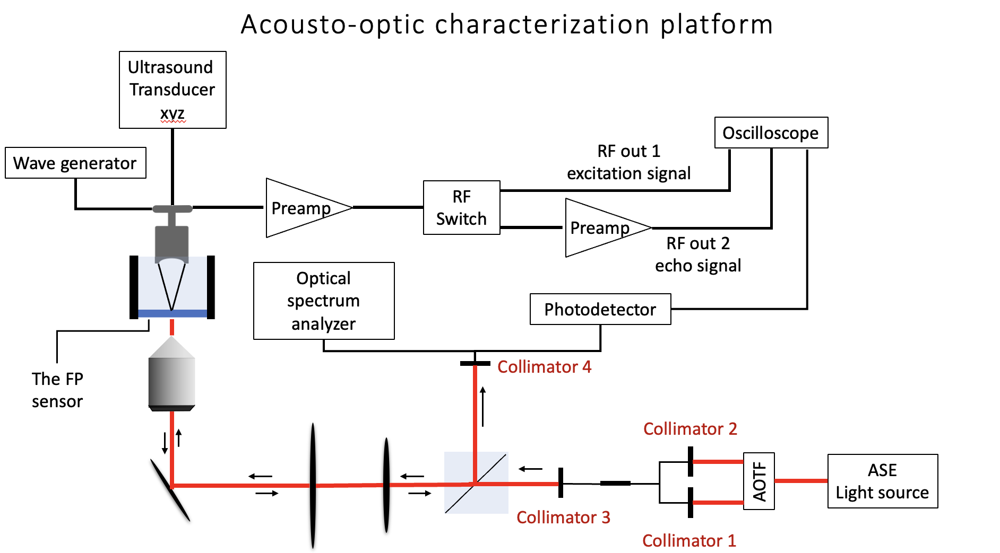
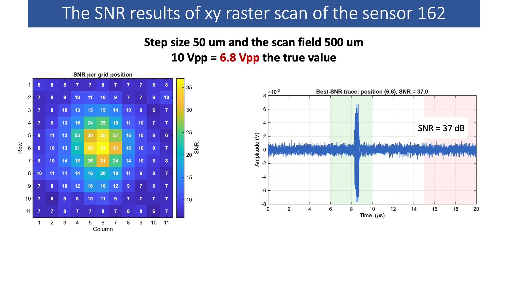
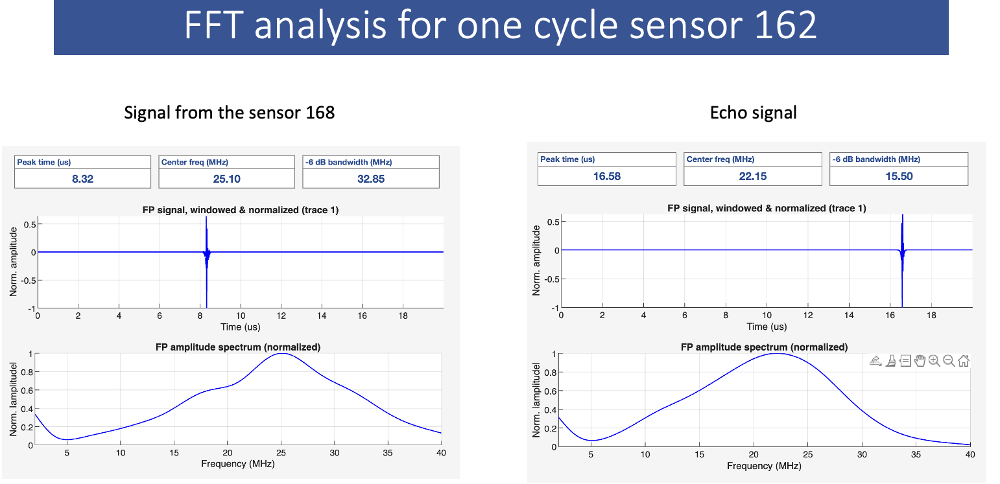
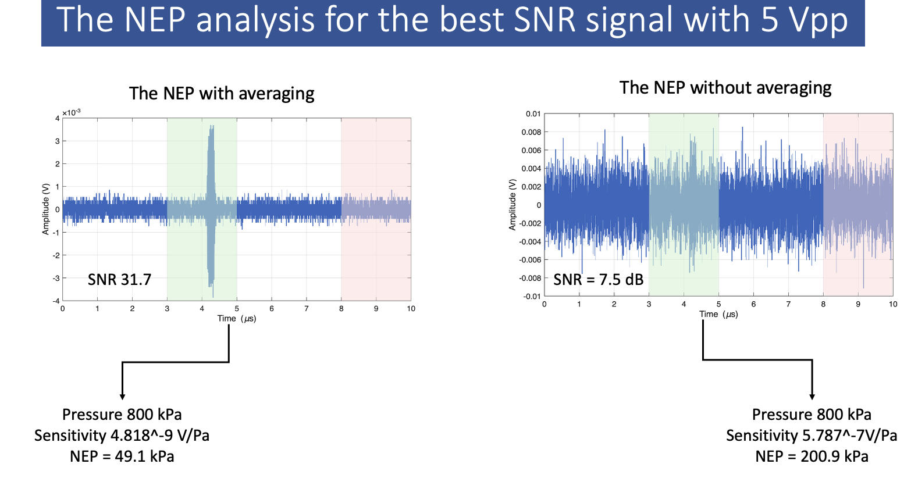
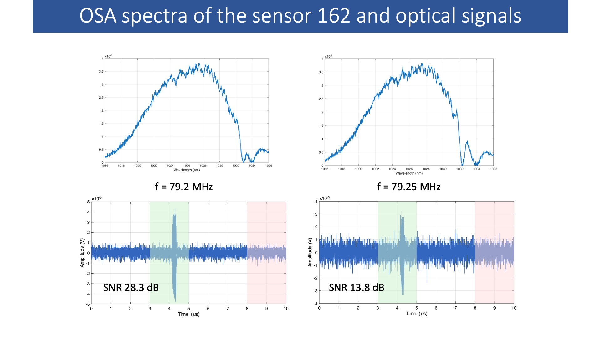

# Sensitivity and frequency response measurements of optical ultrasound sensor
We also call it an acousto-optical characterization platform because we measure the optical-ultrasound sensor response under different applied pressures and ultrasound frequencies.

The system works first by maximizing the echo to make sure the pressure is applied at the correct position on the sensor; this is done using the motor with the z scan. After confirming the correct focal ultrasound point on the sensor, the xy scan starts to align the focal zone of the ultrasound with the interrogation laser beam. The setup is presented in the following scheme:

The platform integrates both the acoustic and optical systems to measure the overall sensitivity, the noise-equivalent pressure, and the frequency response of the sensor. The following code is used to perform an xy scan of the acoustic field with the optical beam:

1. The main xy scan alignment script: `xy_raster_scan.m`
2. The frequency sweep script: `freq_scan.m`
3. The wave generator class: `DG5000Pro.m`
4. The oscilloscope class: `T3DSO2502A.m`
5. The motors class: `PIMotorController.m`
6. The optical spectrum analyzer (OSA) class: `YokogawaOSA.m`
7. Acquiring the spectrum from the OSA: `OSA_acquire_simple.m`

In the lab, we used a GUI designed on top of this code to control the system.

The SNR map of the xy raster scan; the best SNR is indicated by the best alignment.

The frequency response and the NEP for the best SNR signal

  
  

The SNR can be effect with differnt wavelenght that are selected from the reflectivity spectra using an acousto-optical tunable filter (AOTF)

> **Note:** Make sure all the circuits are terminated with 50 Ω. The excitation amplitude of the ultrasound transducer should be measured right before the transducer, not at the wave generator, because there are losses along the way and the true excitation amplitude is important for accurate sensitivity measurements.
